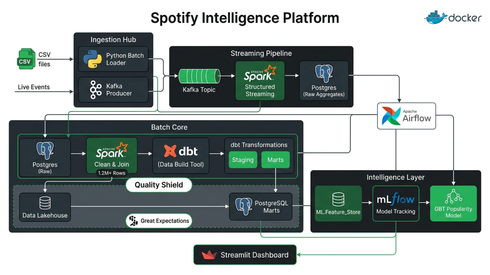

# 🎵 Spotify End-to-End Data Engineering Project

A production-ready data platform designed to process, analyze, and predict music trends using the modern data stack.

---

## 📝 Problem Context
Streaming platforms like Spotify generate billions of data points daily—from song metadata to real-time user playback events. The challenge is to build a system that can ingest 1M+ historical records while simultaneously processing live " playback\ signals to provide immediate business insights and train predictive ML models.

## 🎯 Objective
The goal of this project is to implement a complete **Lambda Architecture** (Batch + Streaming) that:
1. **Ingests** massive track datasets (1.2M+ rows) and real-time Kafka streams.
2. **Transforms** raw data into a clean, analytics-ready Star Schema using dbt.
3. **Validates** data quality at every step using Great Expectations.
4. **Operationalizes** ML models to predict song popularity and classify genres.
5. **Visualizes** platform health and music trends in a premium real-time dashboard.

## 🚀 Solution
A fully containerized ecosystem leveraging:
- **Big Data Processing**: Apache Spark (Batch & Structured Streaming).
- **Messaging**: Apache Kafka for real-time play event ingestion.
- **Modeling**: dbt Core for modular, version-controlled SQL transformations.
- **Workflow**: Apache Airflow orchestrating the entire pipeline.
- **MLOps**: MLflow for model tracking and lifecycle management.
- **Intelligence**: Streamlit for a high-fidelity interactive dashboard.

---

## 🏗️ Architecture

---

## ⚙️ Configuration

### 1. Prerequisites
- **Docker Desktop** (Required)
- **Minimum 8GB RAM** allocated to Docker.
- **Python 3.11+** (Optional, for local env).

### 2. Environment Setup
Clone the repo and create your .env file:
`bash
cp .env.example .env
`

### 3. Data Files
Place the following CSV files in data_sources/raw/:
- racks_features.csv
- racks.csv
- Most Streamed Spotify Songs 2024.csv
- artists.csv

---

## 💻 Running the Project (Local Laptop)

### Step 1: Launch Infrastructure
Start all 13 services (approx. 2-3 mins):
`bash
docker-compose up -d --build
`

### Step 2: Ingest & Process Batch Data
Run the primary Spark processing job and building dbt models:
`bash
# Clean and Join 1.2M tracks
docker exec -u root spotify-spark-master spark-submit --master spark://spark-master:7077 --jars /opt/spark-jobs/jars/postgresql-42.7.1.jar /opt/spark-jobs/job1_clean_and_join.py

# Run SQL transformations
docker exec spotify-airflow-scheduler dbt run --project-dir /opt/airflow/dbt_project
`

### Step 3: Start Real-Time Pipeline
Launch the Kafka producer and the Spark streaming job:
`bash
# Start play event simulation
docker-compose up -d kafka-producer

# Start windowed streaming aggregation
docker exec -u root spotify-spark-master spark-submit --conf \spark.jars.ivy=/tmp/.ivy\ --master spark://spark-master:7077 --packages org.apache.spark:spark-sql-kafka-0-10_2.12:3.5.6 --jars /opt/spark-jobs/jars/postgresql-42.7.1.jar /opt/spark-jobs/job2_structured_streaming.py
`

### Step 4: Train ML Models
Train the popularity and genre models and log them to MLflow:
`bash
docker exec -u root spotify-spark-master spark-submit --master spark://spark-master:7077 --jars /opt/spark-jobs/jars/postgresql-42.7.1.jar /opt/ml/train_popularity_model.py
`

---

## 📊 Access Points
- **Interactive Dashboard**: [http://localhost:8501](http://localhost:8501)
- **Airflow UI**: [http://localhost:8080](http://localhost:8080) (admin/admin)
- **MLflow UI**: [http://localhost:5000](http://localhost:5000)
- **Spark Master**: [http://localhost:8081](http://localhost:8081)
- **Kafka UI**: [http://localhost:8085](http://localhost:8085)

---

## 👤 Author
**Muhammad Irfan Wahyudi**
Big Data and Cloud Computing Engineering Student